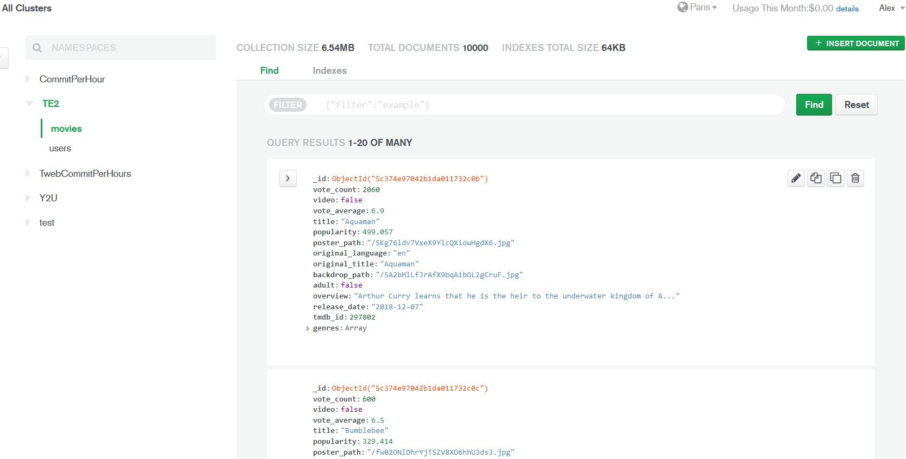
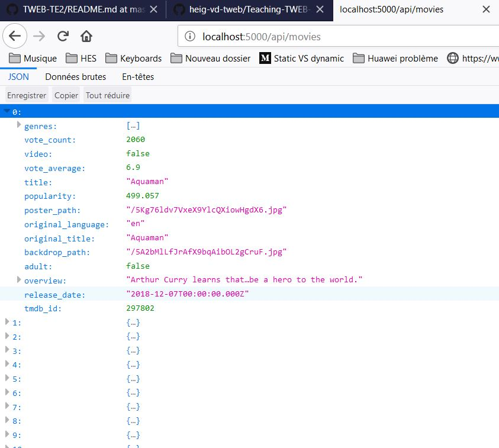

# TWEB-TE2
J'ai fait la partie backend. Je n'ai pas eu le temps de finir ni d'écrire des tests.

Il faut aller sur l'adresse /api pour se connecter à la DB et sur l'adresse /api/movies pour afficher les films.

Import des movies:

Affichage des films

